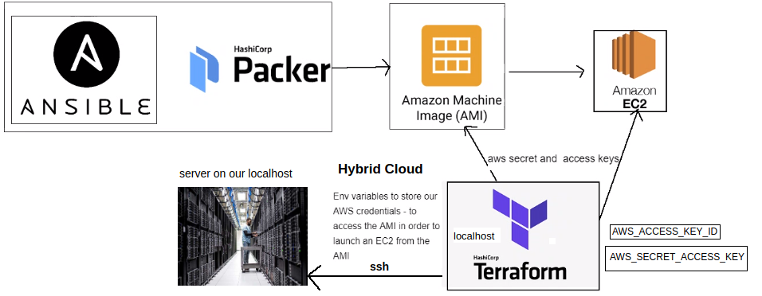
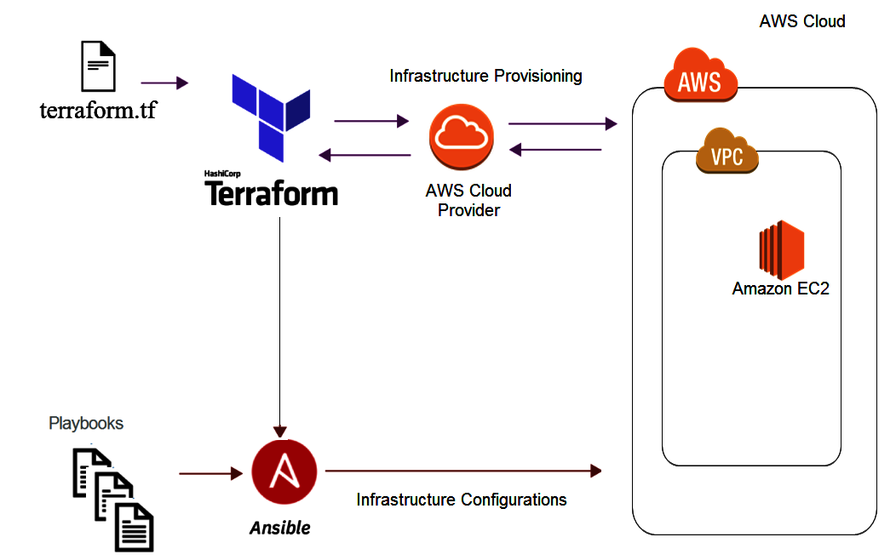
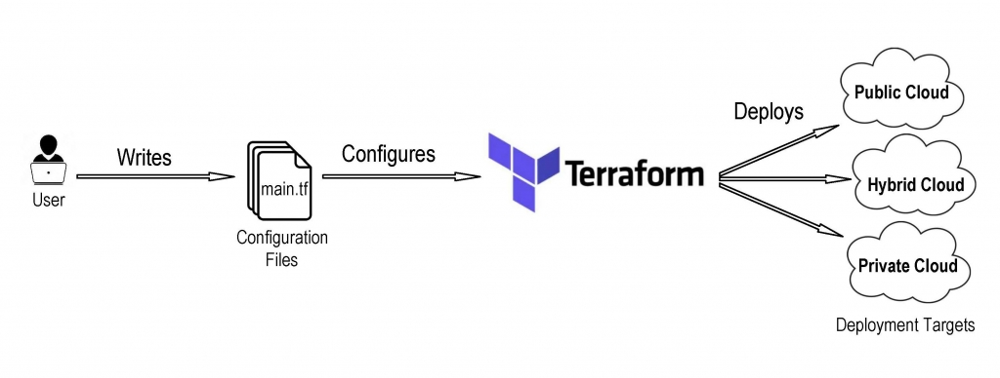
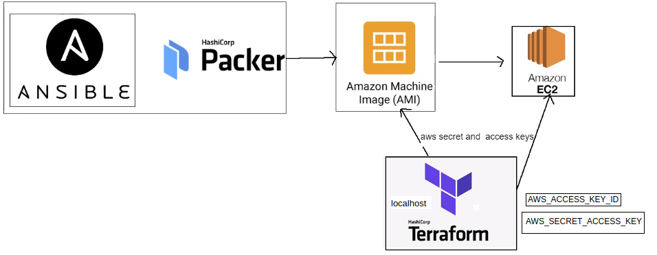
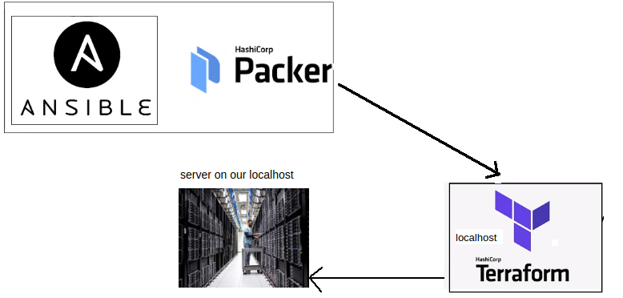
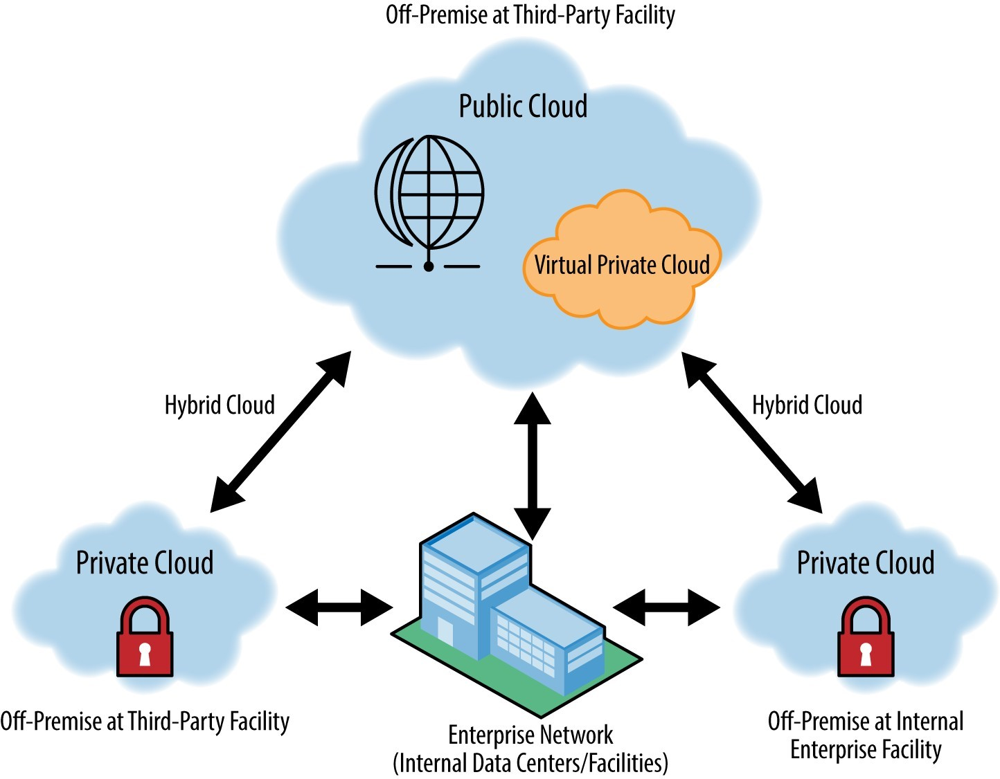
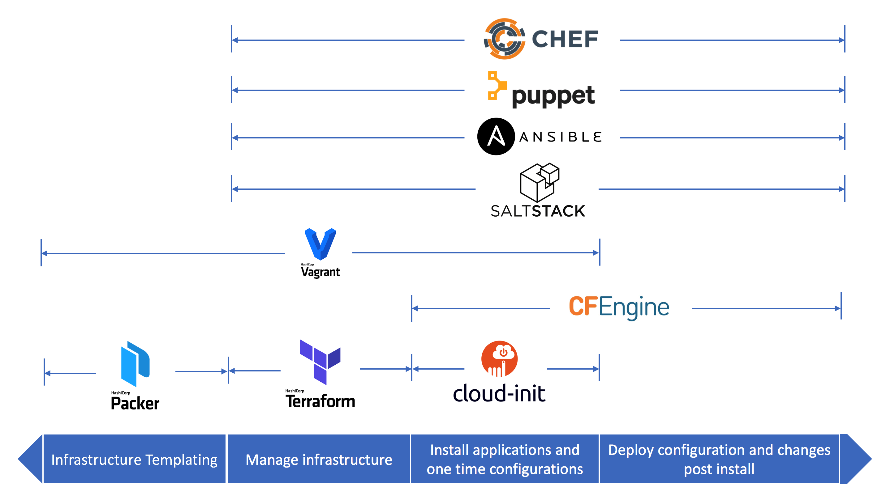

# TERRAFORM



Imagines that we are going to use to create our instances with terraform:

- App ami id: ami-01358d6e34043f36c
- Db ami id: ami-0486e8ec336543ed5

## Terraform and benefits

Is a __orchestration__ tool. Is part of IAC, specifically dealing with orchestration of infrastructure in the cloud. We need orchestration tools and scripts that talk to the cloud to pull them together into the architecture, so Terraform will do this work for us.

Terraform is an open-source infrastructure as code software tool that enables you to safely and predictably create, change, and improve infrastructure. Terraform codifies cloud APIs into declarative configuration files.

Terraform is an open-source infrastructure as code software tool that provides a consistent CLI workflow to manage hundreds of cloud services.

Because Terraform uses a simple syntax, can provision infrastructure across multiple cloud and on-premises data centers, and can safely and efficiently re-provision infrastructure in response to configuration changes, it is currently one of the most popular infrastructure automation tools available.

- Benefits:

1. Terraform modules are small, reusable Terraform configurations for multiple infrastructure resources that are used together. Terraform modules are useful because they allow complex resources to be automated with re-usable, configurable constructs. Writing even a very simple Terraform file results in a module. A module can call other modules—called child modules—which can make assembling configuration faster and more concise. Modules can also be called multiple times, either within the same configuration or in separate configurations.

2. Cloud independent - works with different cloud providers, allowing for multi-cloud configuration. Terraform providers are plugins that implement resource types. Providers contain all the code needed to authenticate and connect to a service—typically from a public cloud provider—on behalf of the user. You can find providers for the cloud platforms and services you use, add them to your configuration, and then use their resources to provision infrastructure. 

3. Can effectively scale up/down to meet the current load.

4. Reduced time to provision and reduced development costs.

5. Ease of use.

6. Simplicity, it makes my life easier. It does a lot of work for us behind, in the background.

7. Independent, so you can use it in any provider.

__So what can we do with it?__

Terraform is a tool for building, changing, and versioning infrastructure safely and efficiently. Terraform can manage existing and popular service providers as well as custom in-house solutions. Configuration files describe to Terraform the components needed to run a single application or your entire datacenter.

Terraform applies to multi-cloud scenarios, where similar infrastructure is deployed on differents providers.

Automated infrastructure management, so terraform can create configuration file templates to define, provision, and configure ECS resources in a repeatable and predictable manner, reducing deployment and management errors resulting from human intervention.

We can use terraform for private cloud, like vagrant, or for public cloud, like AWS, or make the combination of both of them and create a Hybrid Cloud.

Basically, infrastrucute as code, you can use code to manage and maintain resources. It allows you to store the infrastructure status, so that you can track the changes in different components of the system (infrastructure as code) and share these configurations with others.

__Difference between ansible and terraform__

Although ansible can be used both, for configuration management and for orchestration, with terraform we can see the ease of use with a simple language to interpret, that in so few lines of code and with the image of the machine, we can create a new instance in AWS without having to specify many configurations.



__Safety__

Terraform enables you to embed cloud security earlier and leverage automation and code to secure it. By scanning your Terraform modules earlier in the development lifecycle you can actually prevent misconfigurations from being deployed.

All the methods of trying to connect in AWS, terraform check that (in your localhost, check that you have your variables prepared with their values), but AWS needs to verify also, every single request needs to be verified before deploying anything. It check that the key access matches with your account using the `.tf` file. So that's why it is security. Con lo cual podemos ver el gran beneficio de usar distinto provedores y con cada uno de ellos comprueba el accesso con la key. Nos ayuda hacer nuestra vida mas facil, al igual que al cliente, ahorramos tiempo y dinero.

It does the same for any provider, only we have to change the configuration, the value of the tags.

__AWS GovCloud (US) Regions__

AWS GovCloud (US) gives government customers and their partners the flexibility to architect secure cloud solutions.

AWS GovCloud (US-East) and (US-West) Regions are operated by employees who are U.S. citizens on U.S. soil. AWS GovCloud (US) is only accessible to U.S. entities and root account holders who pass a screening process. Customers must confirm that they will only use a U.S. person (green card holder or citizen as defined by the U.S. Department of State) to manage and access root account keys to these regions.

Protect sensitive unclassified data files with server-side encryption in Amazon S3.

Limit access to sensitive data by individual, time, and location and restrict which API calls users are able to make with identity federation, easy key rotation, and other powerful access control testing tools that are available.

In AWS US, they have data centres we can't buy.
Renting the services - pay as you go
Created gov cloud - for government sector only.

Five years ago, companies wanted to migrate to the cloud.
Secret services were not willing to integrate due to security.

Issues:
- Premises goes on fire
- Stealing data (hard drives)
- Physical security only

AWS created Gov cloud to solve these issues.

### Private Cloud, Public Cloud and Hybrid Cloud

It allows us to use terraform at any cloud level:



__Public Cloud__



- Clouds that are hosted and maintained by a cloud computing provider.
- Use case: An image hosting website wants to host a collection of publicly accessible images. backup, disaster recovery, archiving, audit and security logs, etc. High-volume storage with low throughput/performance or infrequent access. Large volumes of storage with low-performance requirements, or infrequent access requirements are well-suited to the Public Cloud.
- Scalability and no Capital cost.

__Private Cloud__



- Clouds hosted and maintained by the user.
- Use case: are used for applications for sensitive data, including financial institutions or goverments. Typically serves the needs of a single organization and is often purpose-built to fit a particular infrastructure and use case. It may be hosted on-premises or in a colocation data center. A government department wants to store sensitive information in a convenient to distribute format.
- Secure, scaling, flexibility and customization.

__Hybrid Cloud__


- A combination of the above two types.
- Use case: migrating workloads to and from the cloud, high Availability and Disaster Recovery, cloud as data center extension. The hybrid cloud is used when storage of sensitive data is required, however the services offered by cloud providers are also needed. A software development company wants to rapidly scale their business because of a spike in server load from active users and make sure that everything is stored safety.
- Greater flexibility, manageable security, advantage of public cloud while doing heavy workloads and the information is secure as private cloud is incorporated within the same.

Summary:




### IaC tools



CI/CD Tools: Jenkins, CircleCI, TeamCity, Bamboo, GitLab.

## Terraform most used commands

- Terraform commands:

````
terraform init
terraform plan
terraform apply
terraform destroy
````

1. Terraform init: initialises the terraform with required dependencies of the provider mentioned in the main.tf.
2. Terraform plan: checks the syntax of the code. Lists the jobs to be done (in main.tf).
3. Terraform apply: launches and executes the tasks in main.tf
4. Terraform destroy: destroys/terminates services run in main.tf

## Who is using Terraform

1289 companies use Terraform in their tech stacks:

- Uber
- Udemy
- Slack
- Instacart
- Robinhood
- Twitch
- Delivery Hero
- LaunchDarkly

### Terraform to launch ec2 with VPC, subnets, SG services of AWS

Let's see what are the steps:

__1: Terraform Installation__

- For Linux:

````
Terraform install:
- download terraform from the link
- sudo mkdir /bin/terraform
- echo "export PATH=$PATH:/bin/terraform" >> ~/.profile
- source ~/.profile
- extract terraform file from archive
- sudo mv /path/to/terraform /bin/terraform/terraform
````

After that, you can use terraform from any path. Let's check that running: `terraform -version`.

- For Windows:

````
Windows:
- Download Terraform for the applicable platform here: https://www.terraform.io/downloads.html
- Extract and place the terraform file in a file location of your choice.
- In Search, type and select Edit the system environment variables.
- Click Environment Variables...
- Edit the Path variable in User variables.
Click New, then add the file path of the terraform file inside (e.g. C:\HashiCorp\Terraform).
- Click Ok until everything closes.
````

__2: Securing AWS keys with Terraform__

- Name env variables as `AWS_ACCESS_KEY_ID`, for secret key `AWS_SECRET_ACCESS_KEY`:

````
# For linux:

sudo echo "export AWS_ACCESS_KEY_ID='var_value'" >> ~/.bashrc
sudo echo "export AWS_SECRET_ACCESS_KEY='var_value'" >> ~/.bashrc
source ~/.bashrc
````

For Windows:

- In Search, type and select Edit the system environment variables.
- Click `Environment Variables...`
- Click `New...` for User variables.
- Set the Variable name as AWS_ACCESS_KEY_ID and add the key as the Variable value.
- Repeat steps 3 and 4 for AWS_SECRET_ACCESS_KEY.
- Click Ok until everything closes.

NOTE: Terraform will look for these keys in the environment variables

__3: Creating an EC2 Instance from an AMI__

- Let's create our Terraform env to access our AMI to launch ec2 instance

We can see how easy it is to create a simple instance in AWS, with a few simple lines of code and the environment variables setted up:

````
provider "aws"{
	region = "eu-west-1"
}

resource "aws_instance" "app_instance"{
	ami = "ami-01358d6e34043f36c"

	instance_type = "t2.micro"

	associate_public_ip_address = true

	tags = {
		Name = "eng84_jose_terraform_nodeapp"
	}
}
````

If you want to be able to ssh to the machine, you have to specify the key. The only line of code that you will need to add in the previous block of code is:

`key_name = "enter ssh key name the .pem/.pub file"`

__4: Creating a VPC__

We will use the tag `aws_vpc`.

````
resource "aws_vpc" "terraform_vpc_code_test"{
	cidr_block = "33.33.0.0/16"
	instance_tenancy = "default"

 	tags = {
	Name = "eng84_jose_terraform_vpc"
	}
}
````

__5: Create and assign a Subnet to a VPC__

We will use the tag `aws_subnet`.

````
resource "aws_subnet" "subnet_vpc_code_test" {
  vpc_id            = aws_vpc.terraform_vpc_code_test.id
  cidr_block        = "33.33.1.0/24"
  availability_zone = "eu-west-1a"

  tags = {
      Name = "eng84_jose_subnet_terraform"
  }
}
````

To know more about how to use terraform, [link](https://registry.terraform.io/providers/hashicorp/aws/latest/docs/resources/default_vpc).

__Applying DRY with Terraform__

- Let's create a file called `variable.tf` to create variables so we could use and resue them in our main.tf file
- `var.name_of_resource`

````
# Creating variables to apply DRY using Terraform variable.tf
# These variables can be called in our main.tf

variable "vpc_id" {

  default = "vpc-07e47e9d90d2076da"
}

variable "name" {
  default = "eng84_jose_terraform_nodeapp"
}

variable "webapp_ami_id" {
  default = "ami-01358d6e34043f36c"
}

variable "aws_vpc" {
  default = "eng84_jose_terraform_vpc"
}

variable "aws_subnet" {
  default = "eng84_jose_terraform_subnet"
}

variable "aws_sg" {
  default = "eng84_jose_terraform_sg"
}

variable "aws_key_name" {

    default = "name of your file"
}

variable "aws_key_path" {

    default = "path for your .pem or .pub file"
}
````

__6: Create and assign a Security Group to a VPC__

We will use the tag `aws_security_group`.

````
resource "aws_security_group" "jose_terraform_code_test_sg" {
 name = "jose_terraform_code_test_sg_app"
 description = "app security group"
 vpc_id = aws_vpc.terraform_vpc_code_test.id

 # Inbound rules for our app
 # Inbound rules code block:
 ingress {
  from_port = "80" # for our to launch in the browser
  to_port = "80" # for our to launch in the browser
  protocol = "tcp"
  cidr_blocks = ["0.0.0.0/0"] # allow all
 }
 # Inbound rules code block ends

 # Outbound rules code block
 egress{
  from_port = 0
  to_port = 0
  protocol = "-1" # allow all
  cidr_blocks = ["0.0.0.0/0"]
 }

 tags = {
  Name = "${var.aws_sg}"
 }
 # Outbound rules code block ends
}
````

### Tasks

__1. Iteration:__

In this first iteration we are going to implement what we have learned previously. For this we have to follow the following steps so that in the end the instance can be created and assigned to the Security Group, Subnet and VPC created.

- Create a VPC.
- Create and assign a Subnet to the VPC.
- Create and assign a Security Group to the VPC.
- Create annd assign a Instance to the Subnet and Security Group.

````
# Provider is a keyword in Terraform to define the name of cloud provider

provider "aws"{
# define the region to launch the ec2 instance in Ireland	
	region = "eu-west-1"
}

# ------------------ 1. Iteration ------------------

# Create a VPC
resource "aws_vpc" "terraform_vpc_code_test"{
 cidr_block = "33.33.0.0/16"
 instance_tenancy = "default"

 tags = {
   Name = "${var.aws_vpc}"
 }
}

# Create and assign a subnet to the VPC
resource "aws_subnet" "subnet_vpc_code_test" {
  vpc_id = aws_vpc.terraform_vpc_code_test.id
  cidr_block = "33.33.1.0/24"
  availability_zone = "eu-west-1a"

  tags = {
    Name = "${var.aws_subnet}"
  }
}

resource "aws_security_group" "jose_terraform_code_test_sg" {
 name = "jose_terraform_code_test_sg_app"
 description = "app security group"
 vpc_id = aws_vpc.terraform_vpc_code_test.id

 # Inbound rules for our app
 # Inbound rules code block:
 ingress {
  from_port = "80" # for our to launch in the browser
  to_port = "80" # for our to launch in the browser
  protocol = "tcp"
  cidr_blocks = ["0.0.0.0/0"] # allow all
 }
 # Inbound rules code block ends

 # Outbound rules code block
 egress{
  from_port = 0
  to_port = 0
  protocol = "-1" # allow all
  cidr_blocks = ["0.0.0.0/0"]
 }

 tags = {
  Name = "${var.aws_sg}"
 }
 # Outbound rules code block ends
}

# Create and assign an instance to the subnet
resource "aws_instance" "app_instance"{
  # add the AMI id between "" as below
  ami = var.webapp_ami_id

  # Let's add the type of instance we would like launch
  instance_type = "t2.micro"

  # Subnet
  subnet_id = aws_subnet.subnet_vpc_code_test.id

  # Security group
  vpc_security_group_ids = [aws_security_group.jose_terraform_code_test_sg.id]

  # Do we need to enable public IP for our app
  associate_public_ip_address = true

  # Tags is to give name to our instance
  tags = {
    Name = "${var.name}"
  }
}

# ------------------ 1. Iteration ends------------------
````

__2. Iteration:__

Launch the app using the AMI of the instance that has the app available and running correctly.

We need to repeat the same steps like before, but we need to add the rest of the network configuration that we manually did using AWS interface:

- Create internet gate way and attach it to our VPC.
- Create public route table and associate it with app subnet.
- Create the script which we will execute to run the app.
- Load this script and inject it into our instance.
- DOD: node-app working in our app instance with terraform script.

````
# Create a VPC
resource "aws_vpc" "jose_terraform_vpc"{
 cidr_block = var.aws_vpc_cidr
 instance_tenancy = "default"

 tags = {
   Name = "${var.aws_vpc}"
 }
}

# Create an internet gateway
resource "aws_internet_gateway" "jose_terraform_igw" {
  vpc_id = aws_vpc.jose_terraform_vpc.id

  tags = {
    Name = var.aws_igw
  }
}

# Editing the main Route Table
resource "aws_default_route_table" "jose_terraform_rt_public" {
  default_route_table_id = aws_vpc.jose_terraform_vpc.default_route_table_id

  route {
    cidr_block = "0.0.0.0/0"
    gateway_id = aws_internet_gateway.jose_terraform_igw.id
  }

  tags = {
    Name = var.aws_public_rt
  }
}

# Create and assign a subnet to the VPC
# Public
resource "aws_subnet" "jose_terraform_public_subnet" {
  vpc_id = aws_vpc.jose_terraform_vpc.id
  cidr_block = var.aws_public_cidr
  availability_zone = "eu-west-1a"

  tags = {
    Name = "${var.aws_subnet_public}"
  }
}

# Associate route tables with the subnet
resource "aws_route_table_association" "jose_terraform_asoc1" {
  subnet_id = aws_subnet.jose_terraform_public_subnet.id
  route_table_id = aws_vpc.jose_terraform_vpc.default_route_table_id
}

# Security group for app
resource "aws_security_group" "jose_terraform_public_sg" {
 name = var.aws_public_sg
 description = "app security group"
 vpc_id = aws_vpc.jose_terraform_vpc.id

 # Inbound rules for our app
 # Inbound rules code block:
 ingress {
  from_port = "80" # for our to launch in the browser
  to_port = "80" # for our to launch in the browser
  protocol = "tcp"
  cidr_blocks = ["0.0.0.0/0"] # allow all
 }
 # Inbound rules code block ends

 # Outbound rules code block
 egress{
  from_port = 0
  to_port = 0
  protocol = "-1" # allow all
  cidr_blocks = ["0.0.0.0/0"]
 }

 # Outbound rules code block ends
}

resource "aws_security_group_rule" "ssh" {
  type              = "ingress"
  from_port         = 22
  to_port           = 22
  protocol          = "tcp"
  cidr_blocks       = [var.my_ip]
  security_group_id = aws_security_group.jose_terraform_public_sg.id
}

# Creating APP instance
resource "aws_instance" "app_instance"{
  # add the AMI id between "" as below
  ami = var.webapp_ami_id

  # Let's add the type of instance we would like launch
  instance_type = "t2.micro"

  # Subnet
  subnet_id = aws_subnet.jose_terraform_public_subnet.id

  private_ip = var.webapp_ip

  # Security group
  vpc_security_group_ids = [aws_security_group.jose_terraform_public_sg.id]

  # Do we need to enable public IP for our app
  associate_public_ip_address = true

  key_name = var.key

  # Tags is to give name to our instance
  tags = {
    Name = "${var.aws_webapp}"
  }

  provisioner "file" {
    source      = "./scripts/init.sh"
    destination = "/home/ubuntu/init.sh"
  }

  # Change permissions on bash script and execute.
  provisioner "remote-exec" {
    inline = [
      "chmod +x /home/ubuntu/init.sh",
      "bash /home/ubuntu/init.sh",
    ]
  }

  connection {
    type        = "ssh"
    user        = "ubuntu"
    private_key = file(var.key_path)
    host        = self.public_ip
  }
}

````
